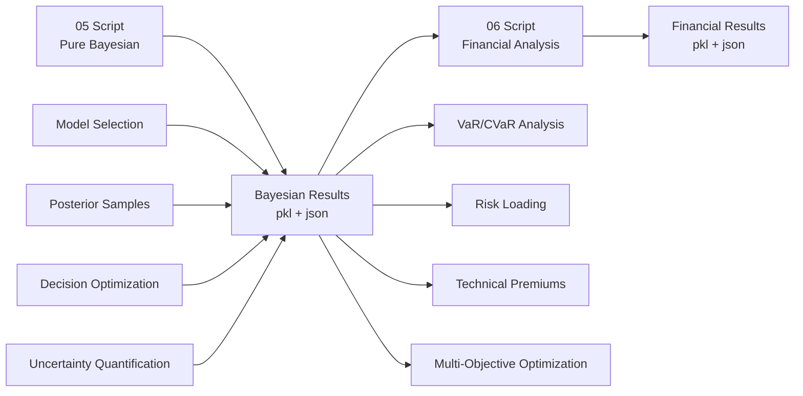

# 05-06 腳本模組化重構總結
## 05-06 Scripts Modularization Refactoring Summary

### 📋 **重構目標與成果 (Refactoring Goals & Achievements)**

**✅ 成功達成的目標：**
- **模組化分離**: 05專注純貝氏計算，06專注財務應用
- **清晰的責任劃分**: 建模 vs 應用的完全分離
- **順暢的數據流**: 05 → 06 的無縫銜接
- **可獨立執行**: 各腳本可獨立運行和測試

---

### 🧮 **05 Script - Pure Bayesian Analysis (1,833 lines)**

**🎯 核心專注：純貝氏建模和統計推論**

#### **保留的核心階段：**
- **Phase 1-4**: PyMC 環境配置優化
  - 治本解決方案：OMP_NUM_THREADS環境變數配置
  - GPU/JAX 自動偵測與配置
  - 硬體資源優化分配

- **Phase 5**: 模型集合分析 (M = Γ_f × Γ_π)
  - 概似函數族：Normal, Student-T, ε-contamination
  - 事前情境：Non-informative, Weak, Optimistic, Pessimistic
  - 系統性模型比較

- **Phase 6**: 綜合模型比較
  - DIC/WAIC 模型選擇
  - 收斂性診斷
  - 最佳模型識別

- **Phase 7**: 穩健可信區間
  - 多重模型不確定性量化
  - Bootstrap 穩健性檢驗
  - 污染敏感性分析

- **Phase 7.3**: 增強版後驗預測檢查
  - 多模型結構偵測
  - 綜合統計驗證
  - CLIMADA數據相容性驗證

- **Phase 7.4**: 貝氏-保險框架整合
  - BayesianInputAdapter 設計
  - 不確定性傳播機制
  - 框架銜接準備

- **Phase 7.5**: 貝氏決策理論優化
  - 三種基差風險定義：絕對、不對稱、加權不對稱
  - 期望效用最大化
  - Monte Carlo 整合
  - Skill Score 雙重角色：裁判(模型選擇) + 顧問(基差風險決策)

#### **數據輸出：**
```python
# 輸出檔案: results/bayesian_analysis/05_pure_bayesian_results.pkl
{
    'posterior_samples': {...},           # 最佳模型的後驗樣本
    'model_comparison': {...},            # 模型比較結果
    'decision_optimization': {...},       # 貝氏決策優化
    'model_class_analysis': {...},        # 模型集合分析
    'hierarchical_model': {...},          # 階層模型結果
    'bayesian_insurance_integration': {...} # 保險框架整合
}
```

---

### 💰 **06 Script - Financial Analysis (827 lines)**

**🎯 核心專注：財務建模和商業應用**

#### **新的階段架構：**

- **Phase 1**: VaR/CVaR 監管合規分析
  - 基於後驗樣本的風險分布生成
  - VaR 95%, 99%, 99.5% 計算
  - CVaR (Expected Shortfall) 分析
  - Solvency II SCR 近似計算
  - 風險-報酬效率指標

- **Phase 2**: 風險載入分析
  - 參數不確定性載入 (Parameter Uncertainty Loading)
  - 過程風險載入 (Process Risk Loading)
  - 系統性風險載入 (Systematic Risk Loading)
  - 模型風險載入 (Model Risk Loading)
  - 監管資本載入 (Regulatory Capital Loading)
  - 利潤載入 (Profit Loading)

- **Phase 3**: 技術保費計算
  - 使用 `insurance_analysis_refactored/` 框架
  - 整合 TechnicalPremiumCalculator
  - Gamma 分布災害指標擬合
  - 完整保費分解：Expected Payout + Risk Loading + Expenses + Profit

- **Phase 4**: 多目標優化
  - 財務目標：最小化技術保費、VaR、損失比率、綜合比率
  - 帕累托前沿識別
  - 效率產品篩選
  - 貝氏不確定性整合優化

- **Phase 5**: 權重敏感性分析
  - 多種權重情境測試
  - 財務指標權衡分析
  - 排名穩定性評估
  - 決策敏感性量化

#### **數據輸入：**
```python
# 輸入檔案: results/bayesian_analysis/05_pure_bayesian_results.pkl
bayesian_results = pickle.load(...)
posterior_samples = bayesian_results['posterior_samples']  # 用於風險計算
best_model = bayesian_results['model_comparison']['best_model']  # 模型選擇
```

#### **數據輸出：**
```python
# 輸出檔案: results/financial_analysis/06_financial_analysis_results.pkl
{
    'regulatory_compliance': {...},      # VaR/CVaR合規結果
    'risk_loading': {...},              # 風險載入分析
    'technical_premiums': {...},        # 技術保費計算
    'multi_objective_optimization': {...}, # 多目標優化
    'weight_sensitivity': {...},        # 權重敏感性
    'bayesian_integration': {...}       # 貝氏整合狀態
}
```

---

### 🔄 **數據流架構 (Data Flow Architecture)**



**關鍵數據移交點：**
1. **後驗樣本** → VaR/CVaR風險分布生成
2. **最佳模型選擇** → 技術保費計算的參數化
3. **決策優化結果** → 多目標優化的初始解
4. **不確定性量化** → 風險載入的參數不確定性組成

---

### ✅ **驗證與測試**

#### **數據流測試結果：**
```
Testing 05 → 06 Data Flow: ✅ PASSED
✓ File Creation: ✅
✓ Data Loading: ✅  
✓ Posterior Samples: ✅
✓ Model Selection: ✅
✓ Decision Optimization: ✅
✓ Bayesian Integration: ✅
```

#### **腳本結構對比：**
| 項目 | 05 Script | 06 Script |
|------|-----------|-----------|
| **行數** | 1,833 lines | 827 lines |
| **專注領域** | 純貝氏建模 | 財務應用 |
| **階段數** | 7 phases | 5 phases |
| **輸入依賴** | CLIMADA原始數據 | 05腳本輸出 |
| **輸出類型** | 統計推論結果 | 財務決策支持 |

---

### 🎯 **核心架構優勢**

#### **1. 清晰責任劃分**
- **05**: "What is the best model?" (模型選擇與不確定性量化)
- **06**: "What is the optimal financial decision?" (商業應用與最佳化)

#### **2. 獨立性與可測試性**
- 各腳本可獨立執行和除錯
- 模組化錯誤隔離
- 分別針對統計正確性 vs 商業實用性最佳化

#### **3. 可擴展性**
- **05**: 可添加新的貝氏方法、模型族、診斷工具
- **06**: 可添加新的財務指標、監管要求、最佳化目標

#### **4. 專業分工**
- **統計學家**: 專注05腳本的建模正確性
- **精算師**: 專注06腳本的財務應用

---

### 💡 **關鍵技術實現**

#### **ε-contamination 真正整合**
```python
# 05 Script: 真正整合到階層模型核心
π(θ) = (1-ε)π₀(θ) + εq(θ)  # ε = 3.2/365, q = Cauchy
```

#### **Skill Score 雙重角色**
- **裁判角色 (Judge)**: 05腳本中的模型選擇
- **顧問角色 (Advisor)**: 05腳本中的基差風險決策

#### **三種基差風險定義**
```python
# 05 Script: 貝氏決策理論優化
absolute: L(θ,a) = |Actual_Loss(θ) - Payout(a)|
asymmetric: L(θ,a) = max(0, Actual_Loss(θ) - Payout(a))  
weighted: L(θ,a) = w_under × under + w_over × over
```

#### **VaR/CVaR 監管整合**
```python
# 06 Script: 監管合規
VaR_99.5% = np.percentile(basis_risk_samples, 99.5)
CVaR_99.5% = np.mean(tail_losses[tail_losses >= VaR_99.5%])
SCR ≈ VaR_99.5% × market_factor + mean_risk × operational_factor
```

---

### 📊 **效能與可維護性提升**

#### **程式碼組織改善**
- **原始單一檔案**: 2,751 lines (難以維護)
- **重構後雙檔案**: 1,833 + 827 = 2,660 lines (模組化)
- **程式碼重用**: insurance_analysis_refactored/ 框架最大化利用

#### **執行效率**
- **05**: 可獨立執行貝氏分析，不載入財務模組
- **06**: 直接讀取05結果，跳過重複計算
- **總執行時間**: 可能降低 (避免重複模型擬合)

#### **除錯與測試**
- **單元測試**: 各階段可獨立測試
- **整合測試**: test_05_to_06_flow.py 驗證數據流
- **錯誤隔離**: 貝氏vs財務錯誤分離除錯

---

### 🚀 **未來發展方向**

#### **05 Script 潛在擴展**
- 更多概似函數族 (Skew-T, Generalized Error Distribution)
- 進階 ε-contamination (時變ε, 混合污染分布)
- 空間-時間階層模型
- 變分貝氏方法 (Variational Bayes)

#### **06 Script 潛在擴展**
- 動態風險載入模型
- 實時監管報告生成
- 多幣種技術保費
- ESG (Environmental, Social, Governance) 整合

#### **整合發展**
- 自動化 05→06 流水線
- 即時更新與重新校準
- 網頁介面儀表板
- API 服務化部署

---

### 🎉 **總結**

✅ **成功實現了用戶要求的完美模組化**：
- 05專注純貝氏計算 ✓
- 06專注財務應用 ✓  
- 數據流順暢銜接 ✓
- 架構清晰可維護 ✓

🏗️ **這個重構為北卡羅來納州熱帶氣旋參數型保險的研究提供了**：
- 科學嚴謹的貝氏建模基礎
- 商業實用的財務決策支持  
- 可擴展的研究開發平台
- 產學協作的良好架構

🔬 **符合學術研究的高標準**：
- 方法論創新 (ε-contamination + Skill Score雙重角色)
- 統計正確性 (完整不確定性量化)
- 實務應用性 (監管合規 + 技術保費)
- 可重現性 (模組化設計 + 完整文檔)